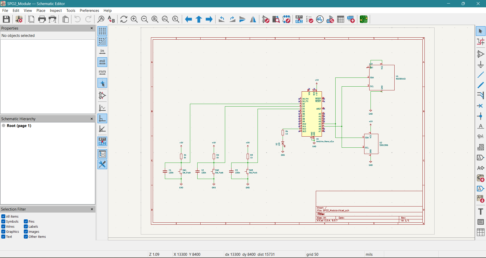
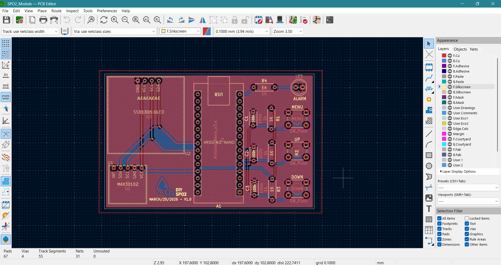
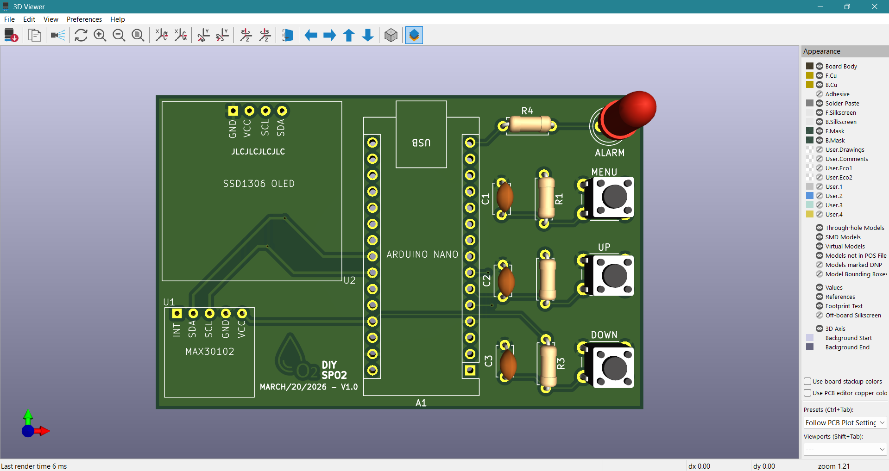

# SpO2 Monitoring Module PCB Design (KiCad)

## Project Overview
This project involves the design of a SpO2 monitoring module PCB using KiCad. The PCB interfaces MAX30102 SpO2 sensor and SSD1306 OLED display with Arduino Nano using I2C communication.

---

## Schematic Design

---

## PCB Layout

---

## 3D View

---

## Features
- MAX30102 SpO2 Sensor Interface
- SSD1306 OLED Display Interface
- Arduino Nano Interface
- Push Buttons (Menu, Up, Down)
- LED Indicator
- I2C Communication
- 2 Layer PCB

---

## Tools Used
- KiCad
- ERC & DRC
- Gerber Generation

---

## Author
Ruthvik R
